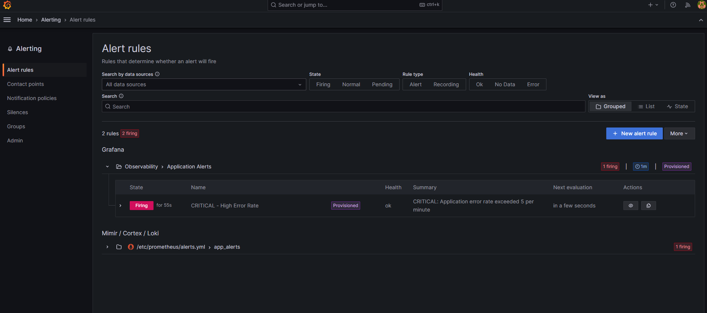

# DevOps Observability — Final Project

A production-ready observability stack for a containerized Node.js service, extended with security automation, CI/CD, reliability improvements, and fully automated environment setup.

| Concern              | Tool                              |
|----------------------|-----------------------------------|
| Metrics              | Prometheus                        |
| Visualization        | Grafana                           |
| Logging              | Loki + Promtail                   |
| Instrumentation      | Node.js + prom-client             |
| Orchestration        | Docker Compose                    |
| CI/CD                | GitHub Actions                    |
| Dependency scanning  | npm audit + Trivy                 |
| Container scanning   | Trivy                             |
| Secrets scanning     | Gitleaks                          |
| Dockerfile linting   | Hadolint                          |
| IaC scanning         | Trivy config                      |

---

## Project Structure

```
devops-observability/
├── .github/
│   └── workflows/
│       ├── ci.yml            # Main CI: lint, audit, scan, integration tests
│       └── security.yml      # Scheduled weekly security scans
├── config/
│   ├── prometheus/
│   │   ├── prometheus.yml    # Scrape targets (app + prometheus self-scrape)
│   │   └── alerts.yml        # Alert rules: error rate, service down, memory
│   ├── loki/
│   │   └── loki-config.yml   # Loki single-instance config
│   ├── promtail/
│   │   └── promtail-config.yml  # Tails volume log, parses JSON → Loki labels
│   └── grafana/
│       └── provisioning/
│           ├── datasources/  # Prometheus + Loki auto-provisioned
│           ├── dashboards/   # Custom metrics dashboard
│           └── alerting/     # Grafana-managed alert rule (error rate)
├── docs/
│   ├── incident-response.md  # Incident runbook + SLO table
│   └── images/               # Evidence screenshots
├── scripts/
│   ├── setup.sh              # Linux/Mac: single-command setup
│   ├── setup.ps1             # Windows: single-command setup
│   ├── validate.sh           # Post-deploy endpoint validation
│   ├── validate.ps1          # Windows version of validate
│   └── rollback.sh           # Rollback to any git ref
├── src/
│   ├── index.js              # Express app: /, /error, /health, /metrics
│   ├── package.json
│   ├── Dockerfile            # Non-root user, HEALTHCHECK, wget
│   └── .dockerignore
├── .env.example              # Environment variable template
├── .gitignore
├── .hadolint.yaml            # Hadolint rule config
├── docker-compose.yml        # Full stack: healthchecks, resource limits, .env
└── Makefile                  # Common operations: make up/down/validate/security-scan
```

---

## Architecture

```
┌─────────────────────────────────────────────────────────────────────┐
│                    Docker Network (observability)                    │
│                                                                      │
│  ┌──────────────────┐  scrape /metrics  ┌──────────────────────┐   │
│  │   Node.js App    │◄──────────────────│      Prometheus      │   │
│  │   (port 3000)    │     every 15s     │      (port 9090)     │   │
│  │                  │                   └──────────┬───────────┘   │
│  │  GET /           │                              │ query          │
│  │  GET /error      │              ┌───────────────▼──────────┐    │
│  │  GET /health     │◄── browser   │         Grafana          │    │
│  │  GET /metrics    │              │        (port 3001)       │    │
│  └────────┬─────────┘              └──────────────────────────┘    │
│           │ JSON logs                            ▲                  │
│           ▼ (shared Docker volume)               │                  │
│  ┌──────────────────┐  tail *.log  ┌────────────┴─────────────┐   │
│  │   app-logs       │◄─────────────│         Promtail         │   │
│  │  Docker Volume   │              └────────────┬─────────────┘   │
│  └──────────────────┘                           │ push             │
│                                  ┌──────────────▼─────────────┐   │
│                                  │            Loki             │   │
│                                  │        (port 3100)          │   │
│                                  └─────────────────────────────┘  │
└─────────────────────────────────────────────────────────────────────┘
```

**Data flow**
- **Metrics:** App exposes `/metrics`; Prometheus scrapes every 15 s; Grafana queries Prometheus for dashboards and alert evaluation.
- **Logs:** App writes JSON to a shared Docker volume; Promtail tails it, parses fields into Loki labels; Grafana Explore queries Loki.
- **Alerts:** Prometheus evaluates rules continuously; Grafana Alerting fires when thresholds are crossed.

---

## Quick Start

### Option A — Automated setup (recommended)

**Linux / macOS / Git Bash:**
```bash
bash scripts/setup.sh
```

**Windows (PowerShell):**
```powershell
.\scripts\setup.ps1
```

The script checks prerequisites, creates `.env` from the template, starts the stack, waits for health, and validates all endpoints.

### Option B — Manual

```bash
cp .env.example .env            # 1. create config
docker compose up --build -d    # 2. start stack
bash scripts/validate.sh        # 3. verify
```

### Service URLs

| Service    | URL                     | Credentials   |
|------------|-------------------------|---------------|
| App        | http://localhost:3000   | none          |
| Grafana    | http://localhost:3001   | admin / admin |
| Prometheus | http://localhost:9090   | none          |
| Loki API   | http://localhost:3100   | none          |

### Tear down

```bash
docker compose down      # stop containers, keep volumes
docker compose down -v   # stop and delete all volumes
```

---

## CI/CD Pipeline

The GitHub Actions pipeline runs on every push to `main` or `develop` and on every pull request targeting `main`.

```
Push / PR
    │
    ├─── lint-and-audit ────────────────────────────────────────┐
    │    • npm audit (fail on critical vulnerabilities)         │
    │    • Hadolint Dockerfile lint (fail on errors)            │
    │                                                           │
    ├─── secrets-scan ──────────────────────────────────────────┤
    │    • Gitleaks full-history scan                           │
    │                                                           │
    ├─── build-and-scan (needs: lint-and-audit) ────────────────┤
    │    • docker build                                         │
    │    • Trivy image scan → SARIF uploaded to GitHub Security │
    │    • Table report printed in CI logs                      │
    │                                                           │
    └─── integration-test (needs: build-and-scan, secrets-scan) ┘
         • cp .env.example .env
         • docker compose up --build -d
         • Wait for /health
         • Smoke tests: /health, /, /error (500), /metrics,
           Prometheus scrapes app metrics
         • docker compose down -v
```

A second workflow (`security.yml`) runs **every Monday at 02:00 UTC** and on manual dispatch:
- Trivy filesystem scan (CRITICAL/HIGH/MEDIUM)
- Trivy IaC / config scan (`docker-compose.yml`, configs)
- Full `npm audit` report
- Gitleaks secrets scan

---

## Security Implementation

### 1. Dependency Vulnerability Scanning

`npm audit --audit-level=critical` runs in CI on every push. Exits non-zero only for critical vulnerabilities, so the build fails fast on exploitable issues without noise from low-severity advisories.

### 2. Container Image Scanning (Trivy)

Trivy scans the built Docker image for OS-level and application-level CVEs before the integration test stage runs. Results are uploaded as SARIF to the GitHub Security tab, and a human-readable table is printed in CI logs.

### 3. Dockerfile Linting (Hadolint)

Hadolint enforces Dockerfile best practices:
- No `latest` tags on base images
- `COPY` preferred over `ADD`
- Non-root user enforced (`USER appuser`)
- `npm cache clean --force` after install to reduce image size

### 4. Secrets Scanning (Gitleaks)

Gitleaks scans the full git history on every push and PR. It also runs in the weekly scheduled workflow. `.env` files are excluded from version control via `.gitignore`; `.env.example` contains only placeholder values.

### 5. IaC / Config Scanning (Trivy config)

Trivy's config scanner audits `docker-compose.yml` and config files for misconfigurations (e.g., privileged containers, missing resource limits, exposed secrets).

### 6. Non-Root Container

The app Dockerfile creates a dedicated `appuser` and switches to it before the `CMD`. The container never runs as root.

### 7. Secrets Management

Environment variables are loaded from `.env` (gitignored). `.env.example` provides the template with safe defaults. In production, swap the `.env` approach for a secrets manager (HashiCorp Vault, AWS Secrets Manager, etc.).

---

## Monitoring & Logging

### Prometheus Metrics

The app exposes:

| Metric                         | Type      | Description                          |
|--------------------------------|-----------|--------------------------------------|
| `app_requests_total`           | Counter   | Total HTTP requests received         |
| `app_errors_total`             | Counter   | Total HTTP 500 responses             |
| `app_http_duration_seconds`    | Histogram | Request duration by route and status |
| Default Node.js process metrics| Various   | Memory, CPU, event-loop lag          |

### Alert Rules

| Alert                      | Severity | Condition                                          |
|----------------------------|----------|----------------------------------------------------|
| `HighErrorRate`            | critical | `rate(app_errors_total[1m]) * 60 > 5`             |
| `AppDown`                  | critical | `up{job="app"} == 0` for 1 m                      |
| `HighMemoryUsage`          | warning  | Process RSS > 200 MB for 2 m                      |
| `PrometheusTargetDown`     | warning  | Any scrape target unreachable for 2 m             |
| `PrometheusConfigReloadFailed` | warning | Config reload failing for 5 m                  |

### Structured JSON Logging

Every request emits a JSON log line: `{ timestamp, level, message, endpoint, method, status }`. Promtail tails the file, parses the JSON, and promotes `level` and `endpoint` into Loki labels, enabling queries like:

```
{service="app", level="error"}
```

---

## Reliability Improvements

### Health Checks

- **App** exposes `GET /health` returning `{ status, uptime, memory, timestamp }`.
- All Docker Compose services define `healthcheck:` blocks. `depends_on` uses `condition: service_healthy` so services only start after their dependencies pass.

### Resource Limits

Each service has `deploy.resources.limits` preventing any single container from starving the host:

| Service    | Memory | CPU  |
|------------|--------|------|
| app        | 256 MB | 0.5  |
| prometheus | 512 MB | 0.5  |
| loki       | 256 MB | 0.25 |
| promtail   | 128 MB | 0.25 |
| grafana    | 256 MB | 0.5  |

### Rollback Procedure

```bash
# Roll back to any git ref (tag, commit SHA, HEAD~1)
bash scripts/rollback.sh HEAD~1
bash scripts/rollback.sh v1.0.0
```

The script: brings the stack down → checks out the target ref → rebuilds → waits for health → runs `validate.sh`.

### Incident Response

See [`docs/incident-response.md`](docs/incident-response.md) for runbooks covering:
- High error rate
- Container down
- Grafana unreachable
- Log gap (Loki/Promtail)

---

## Triggering the CRITICAL Alert

```bash
# Send 20 errors in quick succession
for i in {1..20}; do curl -s http://localhost:3000/error > /dev/null; done
```

PowerShell:
```powershell
for ($i = 0; $i -lt 20; $i++) {
    Invoke-WebRequest -Uri http://localhost:3000/error -UseBasicParsing | Out-Null
}
```

Then open **Grafana → Alerting → Alert rules** — the `CRITICAL - High Error Rate` rule turns Firing within 30 seconds.

---

## Make Targets

```bash
make setup          # first-run: copy .env, build, start, validate
make up             # docker compose up --build -d
make down           # docker compose down
make clean          # docker compose down -v
make logs           # docker compose logs -f
make status         # docker compose ps
make health         # pretty-print /health JSON
make validate       # run scripts/validate.sh
make security-scan  # npm audit + Hadolint + Trivy (local)
```

---

## Evidence

### Grafana dashboard with application metrics


### Loki log analysis with filtered JSON logs


### Grafana Alerting tab with active alert rule

